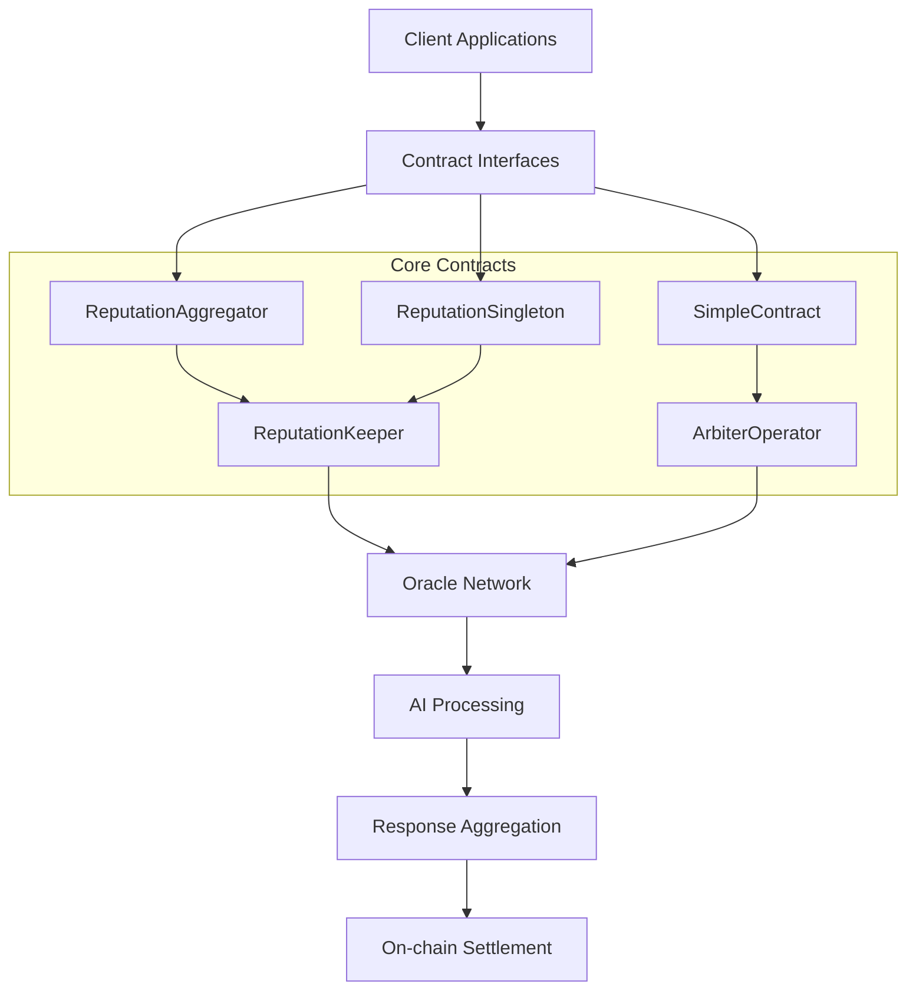

# Verdikta Dispatcher Smart Contracts

The Verdikta Dispatcher is a comprehensive smart contract system that provides decentralized AI-powered dispute resolution services. It consists of multiple specialized contracts that work together to manage oracle networks, handle requests, aggregate responses, and maintain reputation systems.

## Architecture Overview



## Contract Components

### Core Aggregation Contracts

| Contract | Purpose | Use Case |
|----------|---------|----------|
| **[ReputationAggregator](contracts/reputation-aggregator.md)** | Multi-oracle commit-reveal aggregation | High-stakes disputes requiring maximum security |
| **[ReputationSingleton](contracts/reputation-singleton.md)** | Single-oracle fast resolution | Simple disputes needing quick resolution |
| **[SimpleContract](contracts/simple-contract.md)** | Basic oracle interaction | Development and testing |

### Infrastructure Contracts

| Contract | Purpose | Use Case |
|----------|---------|----------|
| **[ReputationKeeper](contracts/reputation-keeper.md)** | Oracle reputation and selection | Managing oracle quality and availability |
| **[ArbiterOperator](contracts/arbiter-operator.md)** | Chainlink operator with restrictions | Ensuring only approved contracts can request oracles |

## Network Deployments

### Base Sepolia (Testnet)
- **LINK Token**: `0xE4aB69C077896252FAFBD49EFD26B5D171A32410`
- **Verdikta Token**: `0xe46F6b494F111d958CDBB52536AD78c4eEeB0149`
- **Wrapped Verdikta Token**: `0x2F1d1aF9d5C25A48C29f56f57c7BAFFa7cc910a3`

### Ethereum Sepolia (Testnet)
- **LINK Token**: `0x779877A7B0D9E8603169DdbD7836e478b4624789`
- **Verdikta Token**: `0xbb7079F45367ce928789cc40d8C9D4E3A19b0a49`

## Quick Start

### For Developers
1. **Choose Your Contract**: Start with [ReputationSingleton](contracts/reputation-singleton.md) for simple use cases
2. **Review Integration**: See [Integration Examples](examples/index.md) for code samples
3. **Deploy & Test**: Follow our [Deployment Guide](deployment/index.md)

### For Oracle Operators
1. **Deploy Operator**: Set up an [ArbiterOperator](contracts/arbiter-operator.md) contract
2. **Register Oracle**: Register with the [ReputationKeeper](contracts/reputation-keeper.md)
3. **Monitor Performance**: Track reputation scores and earnings

## Getting Started

### Integration Examples

```solidity
// Simple integration with ReputationSingleton
contract MyDApp {
    IReputationSingleton public verdiktaDispatcher;
    
    function requestDispute(string[] memory evidence) external {
        bytes32 requestId = verdiktaDispatcher.requestAIEvaluationWithApproval(
            evidence,
            "Additional context",
            500,    // alpha (reputation weight)
            0.1 ether,  // max oracle fee
            0.01 ether, // estimated base cost
            5,      // max fee scaling factor
            1       // requested class
        );
        
        // Store requestId and wait for fulfillment
    }
}
```

### Frontend Integration

```javascript
// Connect to deployed contract
const contract = new ethers.Contract(
    contractAddress,
    REPUTATION_SINGLETON_ABI,
    signer
);

// Submit evaluation request
const tx = await contract.requestAIEvaluationWithApproval(
    ["QmHash1", "QmHash2"], // IPFS content hashes
    "Additional evidence",   // Optional addendum
    500,        // alpha (reputation weight 0-1000)
    ethers.parseEther("0.1"), // max oracle fee
    ethers.parseEther("0.01"), // estimated base cost
    5,          // max fee scaling factor
    1           // requested class (oracle type)
);

// Monitor for results
contract.on("EvaluationFulfilled", (requestId, likelihoods, justificationCID) => {
    console.log("Evaluation complete:", {
        requestId,
        likelihoods: likelihoods.map(l => l.toString()),
        justificationCID
    });
});
```

## API Reference

- **[Contract Interfaces](api/index.md)** - Complete ABI documentation
- **[Events Reference](api/events.md)** - All contract events and their parameters
- **[Error Codes](api/errors.md)** - Error conditions and troubleshooting

## Advanced Topics

- **[Reputation System](advanced/reputation.md)** - How oracle scoring works
- **[Fee Mechanisms](advanced/fees.md)** - Understanding fee calculations
- **[Security Model](advanced/security.md)** - Commit-reveal and other protections
- **[Oracle Selection](advanced/oracle-selection.md)** - Weighted selection algorithms

## Support

- **[Troubleshooting](troubleshooting/index.md)** - Common issues and solutions
- **[FAQ](faq.md)** - Frequently asked questions
- **[Discord](https://discord.gg/verdikta)** - Community support
- **[GitHub Issues](https://github.com/verdikta/verdikta-dispatcher/issues)** - Report bugs 